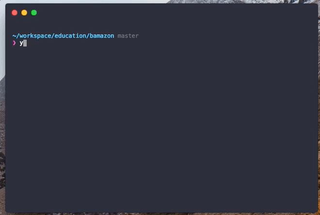
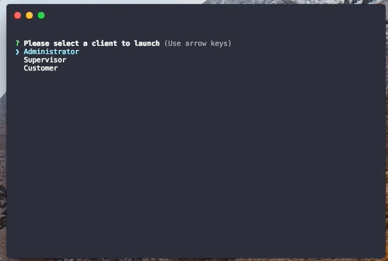
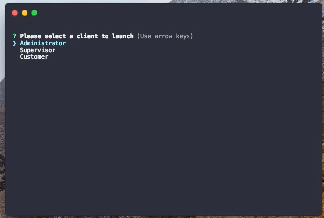
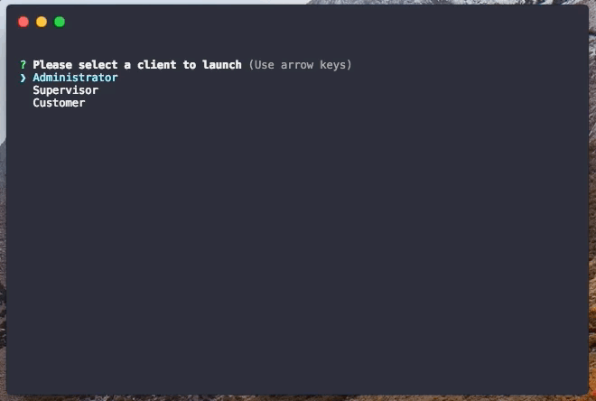

<h1 align="center">✨ Bamazon 📦</h1>

A UNC-CH CB homework assignment

<h2 align="center">👨‍💻 Setup</h2>

  

  <strong>Setup the database</strong>
   
  <code>$ yarn db:setup</code>
   
  *may require sudo

 

  <strong>Run the app</strong>
   
  <code>$ yarn start</code>

<h2 align="center">💵 Purchase products</h2>

  

<h2 align="center">➕ Add products</h2>

  

<h2 align="center">📈 Observe sales</h2>

  

